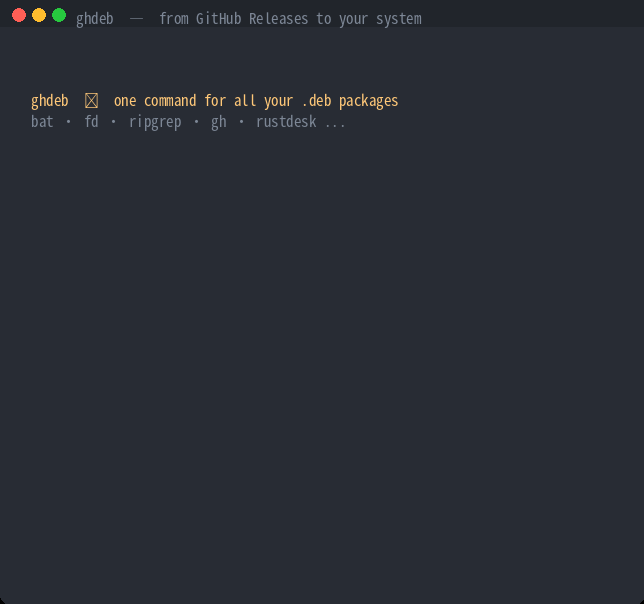

# ghdeb — Install & Upgrade .deb Packages from GitHub Releases



> ⭐ **ghdeb saves you time? Give it a star!** It helps other Linux users discover this tool.
> [⭐ Star ghdeb](https://github.com/LeisureLinux/ghdeb) · [🍴 Fork](https://github.com/LeisureLinux/ghdeb/fork)

[](https://github.com/LeisureLinux/ghdeb/releases)
[](LICENSE)
[](https://github.com/LeisureLinux/ghdeb/stargazers)
[](https://github.com/LeisureLinux/ghdeb/network)

**ghdeb** is a lightweight CLI tool that manages `.deb` packages downloaded from GitHub Releases — one command, no PPA, no manual download. It ships with a curated list of known GitHub `.deb` packages for short-name installs.

```bash
ghdeb install LeisureLinux/ghdeb      # install latest ghdeb
ghdeb update                          # refresh version info to local snapshot (like apt update)
ghdeb list                            # list all catalog entries (reads local snapshot)
```

## What problem does ghdeb solve?

Many excellent CLI tools — **bat**, **fd**, **ripgrep**, **gh**, **rustdesk**, **localsend** — distribute `.deb` packages via GitHub Releases, but the install workflow is painful:

1. Open the GitHub releases page
2. Find the correct `.deb` file for your architecture
3. Copy the download URL, `wget` it
4. `sudo dpkg -i` to install
5. Repeat all of the above for every upgrade

**ghdeb reduces this to a single command.**

## How to install ghdeb?

### 方式一：通过 Freelamp APT 仓库安装（推荐）

支持 amd64 / arm64 / armhf / loong64 / riscv64，Debian / Ubuntu 通用：

```bash
# 一次性配置 APT 源（含 GPG 公钥）
curl -fsSL https://repo.freelamp.com/apt.key | sudo gpg --dearmor -o /usr/share/keyrings/freelamp.gpg
echo "deb [signed-by=/usr/share/keyrings/freelamp.gpg] https://repo.freelamp.com bookworm main" \
  | sudo tee /etc/apt/sources.list.d/freelamp.sources

# 更新并安装
sudo apt update
sudo apt install ghdeb
```

### 方式二：通过 ghdeb 自身安装（GitHub Releases）

```bash
# Download and install the latest release
ghdeb install LeisureLinux/ghdeb

# Or install a specific version
ghdeb install LeisureLinux/ghdeb@v0.6.0
```

### 方式三：从源码编译

```bash
git clone https://github.com/LeisureLinux/ghdeb.git
cd ghdeb && make build && sudo make install
```

## How to use the package catalog?

ghdeb ships with a curated catalog of 50+ popular GitHub `.deb` packages. You can install them by short name:

```bash
# Install by short name (mapped via catalog)
ghdeb install bat                     # → sharkdp/bat
ghdeb install fd                      # → sharkdp/fd
ghdeb install ripgrep                 # → BurntSushi/ripgrep
ghdeb install gh                      # → cli/cli

# Search the catalog
ghdeb search monitor                  # regex search by name/summary
ghdeb update                          # refresh version info to local snapshot
ghdeb list                           # list all catalog entries (reads local snapshot)
ghdeb catalog show bat                # show entry details
```

### Adding custom packages to the catalog

```bash
# Add a GitHub-hosted package
ghdeb catalog add myapp --repo user/myapp --summary "My awesome app"

# Add a non-GitHub source (direct .deb URL)
ghdeb catalog add myapp --url "https://example.com/myapp_{version}_{arch}.deb"

# Change the repo of an existing entry
ghdeb catalog modify myapp --repo user/myapp2

# Remove an entry
ghdeb catalog delete myapp
```

Catalog entries are stored in the system catalog at `/etc/ghdeb/catalog.toml`.

## How to manage packages?

```bash
# Reinstall a package
ghdeb reinstall bat

# Uninstall and purge config
ghdeb purge rustdesk

# Clean downloaded .deb cache
ghdeb clean
ghdeb clean --dry-run                 # preview only
```

## How to install any .deb package from GitHub?

```bash
# Install the latest release of any GitHub project that provides .deb assets
ghdeb install cli/cli               # GitHub CLI
ghdeb install rustdesk/rustdesk     # RustDesk remote desktop
ghdeb install localsend/localsend   # LocalSend file sharing
ghdeb install jgraph/drawio         # draw.io diagrams

# Install a specific version
ghdeb install LeisureLinux/ghdeb@v0.6.0
```

ghdeb automatically detects your system architecture (`dpkg --print-architecture`) and selects the matching `.deb` asset from the release.

## How to refresh version info?

`ghdeb update` works like `apt update`: it queries each catalog entry's latest
version from GitHub, checks the locally installed version, determines which
packages are upgradeable, and removes catalog entries that no longer provide a
`.deb` for your architecture. The results are saved to a single system-level cache file
(`/var/cache/ghdeb/cache.json`), and `ghdeb list` reads only that cache without
hitting the network. Like `apt update`, `ghdeb update` writes to the root-owned
system cache and may prompt for `sudo`.

```bash
# Refresh version info and prune stale entries
ghdeb update

# List entries (reads the local snapshot, no network)
ghdeb list
```

## How to upgrade all GitHub-sourced packages?


```bash
# Upgrade everything ghdeb manages
ghdeb upgrade

# Upgrade a specific package
ghdeb upgrade LeisureLinux/ghdeb

# Upgrade by package name
ghdeb upgrade rustdesk
```

## How to maintain the package catalog?

ghdeb uses the curated `catalog.toml` directly — it does not scan packages installed on your system. You can still maintain the catalog manually:

```bash
# Change the GitHub repo behind a catalog entry
ghdeb catalog modify <name> --repo owner/repo

# Validate one entry (drop it if no matching-arch .deb exists)
ghdeb catalog validate <name>

# Validate the whole catalog (drop every entry without a matching-arch .deb)
ghdeb catalog validate --all
```

`catalog validate` removes any entry whose latest Release lacks a `.deb` for your architecture. `catalog modify` lets you repoint an entry to a different GitHub repository.

## How to view package information?

```bash
# Show latest release info (without installing)
ghdeb info LeisureLinux/ghdeb

# Refresh version info (GitHub latest + installed) into local snapshot
ghdeb update

# List all managed packages with versions (reads local snapshot)
ghdeb list

# View operation history for a package
ghdeb history LeisureLinux/ghdeb
```

## How does architecture matching work?

ghdeb intelligently matches release assets to your system architecture:

| System Arch | Matches Filename Keywords |
|-------------|---------------------------|
| amd64       | amd64, x86_64, x86-64, x64 |
| arm64       | arm64, aarch64            |

It prefers standard packages and skips musl/static/portable variants.

### x86-64 microarchitecture variants (v2/v3/v4)

Some projects (e.g. `daeuniverse/dae`) publish multiple `.deb` files targeting
different x86-64 CPU microarchitecture levels, named like
`dae-linux-x86_64_v3_avx2.deb`. ghdeb inspects `/proc/cpuinfo` to detect the
highest x86-64 microarchitecture level your CPU supports (v1/v2/v3/v4 per the
x86-psABI levels) and automatically picks the best-matching variant:

- **v1** — baseline x86-64
- **v2** — SSE4.2 / POPCNT / CX16 / LAHF-LM
- **v3** — AVX2 / BMI1 / BMI2 / FMA / F16C / MOVBE
- **v4** — AVX-512 (AVX512F/BW/CD/DQ/VL)

A level-N CPU will prefer a `_vN_` asset it can run, falling back to the plain
`x86_64` package when no matching variant exists.

## How to configure a proxy for GitHub downloads?

```bash
# Via environment variable
export https_proxy=http://your-proxy:8080
ghdeb install LeisureLinux/ghdeb

# Or via config file (~/.config/ghdeb/config.json)
echo '{"proxy": "http://your-proxy:8080"}' > ~/.config/ghdeb/config.json
```

ghdeb also supports download retry (3 attempts with exponential backoff) and resume downloads.

## How to set up shell autocompletion?

```bash
# zsh — installed at
#   /usr/share/zsh/site-functions/_ghdeb
# bash — installed at
#   /usr/share/bash-completion/completions/ghdeb
# fish — installed at
#   /usr/share/fish/vendor_completions.d/_ghdeb
```

## How does ghdeb compare to other tools?

| Tool | Approach | Limitation |
|------|----------|------------|
| **ghdeb** | Client-side CLI, zero config | — |
| gitdeb | Shell script | No stars, no community validation |
| debian-package-installer | Python + JSON config | Requires configuration files |
| github-apt-repos (★110) | Server-side APT repo builder | Overkill for personal use |
| inapt (★8) | Server-side APT proxy | Requires infrastructure |
| apt-transport-github (★13) | APT transport | Marked "NOT YET READY", unmaintained |

**ghdeb fills the gap for a lightweight, zero-config client-side CLI tool.**

## FAQ

### Does ghdeb replace apt?
No. ghdeb manages packages that are **not** in any apt repository — typically `.deb` files distributed via GitHub Releases. Regular system packages should still be managed with `apt`.

### What happens if I remove a package with `apt remove`?
ghdeb detects the actual installation state via `dpkg-query`. Running `ghdeb upgrade` will automatically reinstall packages that were removed but are still tracked.

### Does ghdeb support non-.deb assets?
ghdeb focuses on `.deb` packages. For other asset types (AppImage, tarball), use the GitHub release page directly.

### Is ghdeb safe to use?
ghdeb downloads `.deb` files from official GitHub Releases and installs them with `dpkg -i`. It sets `DEBIAN_FRONTEND=noninteractive` to avoid interactive prompts. Always review packages from third-party repositories.

## ☕ Support / 打赏支持

If ghdeb saves you time, consider buying me a coffee ☕

| 微信 / WeChat | 支付宝 / Alipay |
|-------------|-----------------|
|  |  |

[](https://github.com/sponsors/LeisureLinux)

## License

MIT
